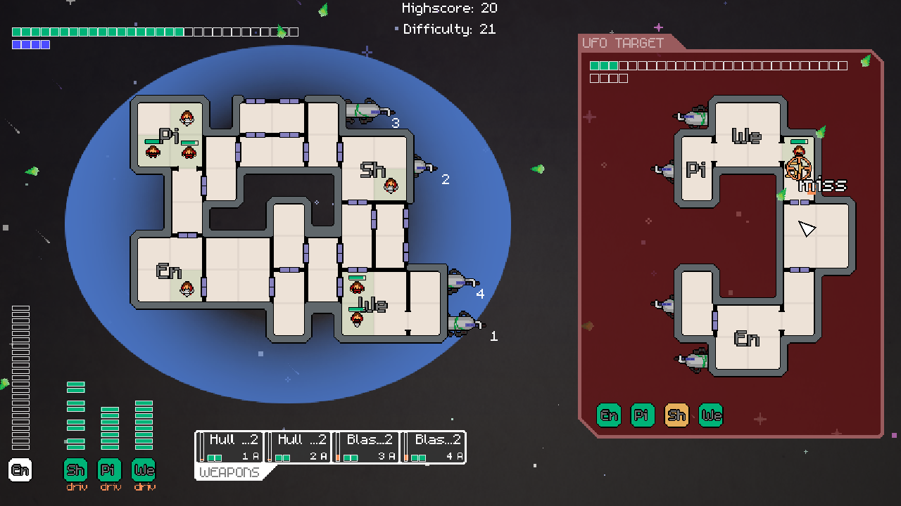
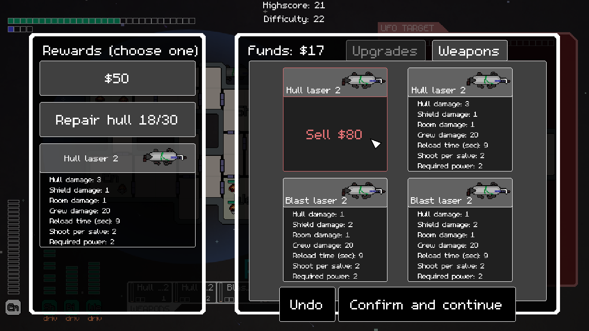
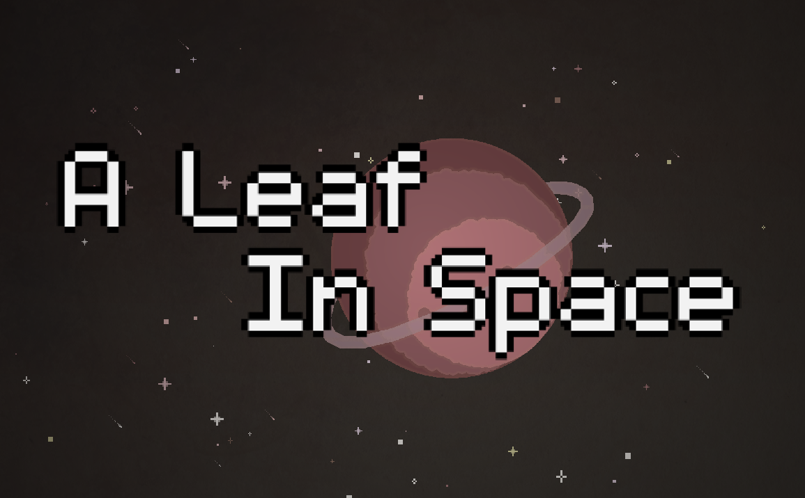

# A Leaf In Space
A Leaf In Space is a clone of Faster Than Light made in two weeks in Gamemaker for the OperaGX Gamejam.

It can be played for free, directly in your browser at [A Leaf In Space](https://gamejolt.com/games/alip/637520) and a run only takes a few minutes so nothing's stopping you from giving it a try!

A small difference with FTL is that between each encounter you choose a reward between 3 different items, à la Slay The Spire.

## About the OperaGX gamejam
The theme of the game jam was "UFO" and the goal was for the game to be run when you don't have internet on Opera GX browser. 
A requirement was for the game to be under 5 Mb (A Leaf In Space's build is just below at 4.75 Mb uncompressed).

## Credit

- Programing and Art - [Simon Andersen](https://twitter.com/SimAndersenDev)
- Music and Sound Design - [Zenibuka](https://soundcloud.com/zenibuka)

We also used the font [m5x7](https://managore.itch.io/m5x7) made by Daniel Linssen.

